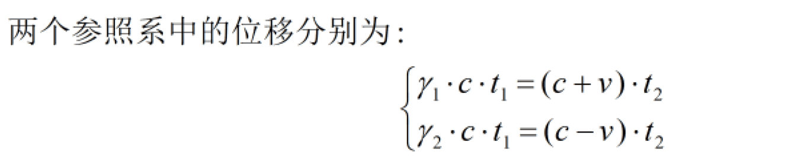
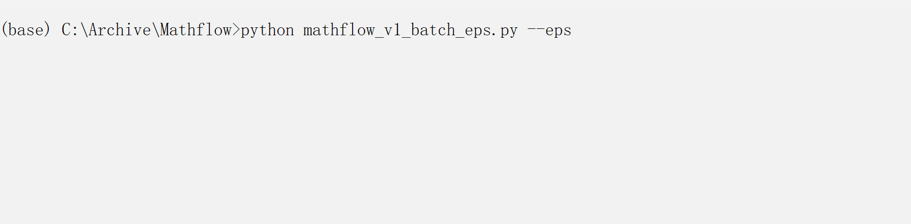

[](https://github.com/Andrews-Ma/MathType-to-Markdown/blob/main/LICENSE.txt)
[](https://www.python.org/)
[](https://github.com/Andrews-Ma/MathType-to-Markdown/stargazers)
[](https://github.com/Andrews-Ma/MathType-to-Markdown/network/members)
[](https://github.com/Andrews-Ma/MathType-to-Markdown/issues)
[](https://github.com/Andrews-Ma/MathType-to-Markdown/commits/main)

# MathFlow

**Typora 用户的 MathType 公式救星**  
一键清洗 LaTeX + 批量还原 EPS 为可编辑 Markdown 公式

让学术写作、论文笔记、博客创作中的公式转换不再痛苦！

## ✨ 核心功能

- **实时快捷键转换**（`mathflow_v1_hotkey.py`）  
  在 MathType 中复制公式后，按 **Ctrl + Alt + V** 即可自动清洗 LaTeX 源码（去除冗余标签、还原中文字符、注入 `matrix` 环境），直接粘贴到 Typora 中完美显示。

- **EPS 批量转换**（`mathflow_v1_batch_eps.py`）  
  自动扫描文件夹中的所有 `.eps` 文件，提取 MathML 并生成可编辑 Markdown 公式，彻底解决旧公式无法编辑的问题。

- **纯 Python 实现**，轻量、无需复杂环境，专为 Typora 用户深度优化。

## 🎥 演示

**实时快捷键清洗 LaTeX（Ctrl + Alt + V）**  


**EPS 文件批量转换为可编辑 Markdown 公式**  


## 🚀 快速开始

### 1. 环境准备
```bash
git clone https://github.com/Andrews-Ma/MathType-to-Markdown.git
cd MathType-to-Markdown
pip install -r requirements.txt
